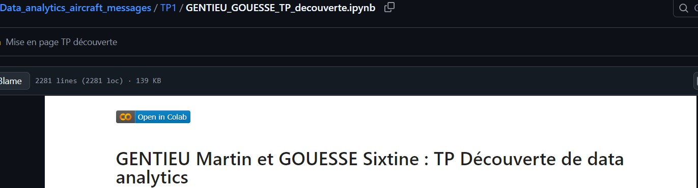
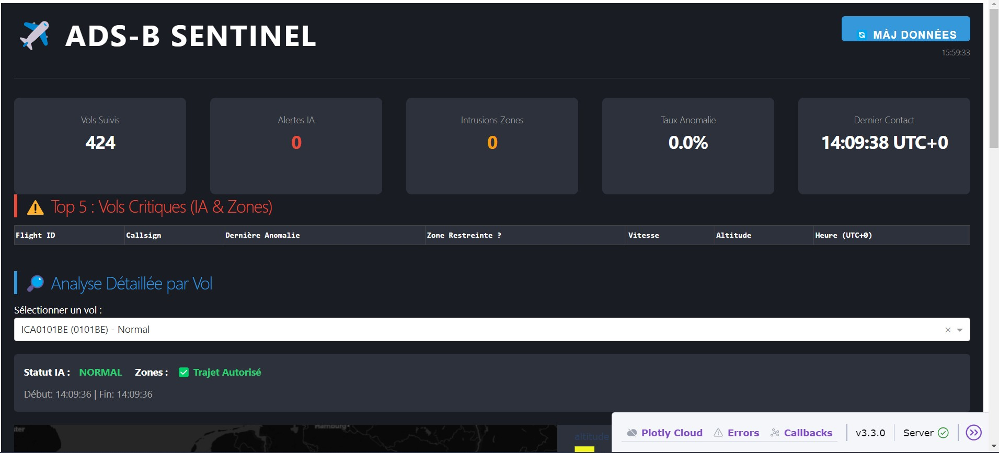

# Data_analytics_aircraft_messages

## **À l'attention du correcteur :** 

#### **Pour chaque TP (TP1 à TP4) :**

- Récupérez le notebook présent dans le dossier
- L'ouvrir dans Google Colab (vous pouvez utiliser le lien présent en ouvrant le notebook Jupyter) *
- Allez dans le terminal et clônez le projet
- Vous pouvez à présent exécuter le notebook.

* Pour le lien vers Colab, voici une illustration :


## **Pour le projet :**

#### **Diapositives pour la soutenance : [Lien vers le pdf](Projet\Diapositives_soutenance_Projet_data_analytics.pdf)**

### Strcuture du code :

- **`recuperation_donnees.py`** : Récupère les 10 000 messages ADS-B les plus récents et enregistre les données dans le CSV : `raw_data.csv`.
- **`transform_data.py`** : Transforme le dataset pour le nettoyer et ajouter certains attributs (déviation en m, autopilotage on/off, trajectoire prévue, entre dans une zone interdite, etc.)
Enregistre la sortie dans `flight_data_transformed.csv`.
- **`model.py`** : Charge un Random Forest déjà entraîné sur le dataset `dataset_trajectoires_anomalies.csv` et donne le type d'anomalie prédit.
- **`app.py`** : Initialise le Dashboard sur le localhost (ici **`127.0.0.1:8050`**) et affiche des informations sur les données collectées, comme le nombre d'avions suivis et les anomalies récentes détectées.
- **`__main__.py`** : Fichier qui lance le programme (Crée le dataset si besoin et charge le dashboard.)

### Instructions pour l'installation :

Le projet a quant à lui été exécuté en local, mais il devrait aussi fonctionner dans un notebook avec Colab.

Consignes d'installation : (*Instructions pour windows*)

- Ouvrez une instance de Windows Powershell (dans VScode par exemple)
- Placez-vous dans le répertoire du projet
```bash
cd Chemin/Data_analytics_aircraft_messages/Projet
```
- Créez et paramétrez un environnement virtuel :
```bash
python3.12 -m venv .venv
.venv\Scripts\Activate
```
- Installez les packages :
```bash
pip install -r requirements_projet.txt
```
- Créez le fichier d'environnement **`.env`**, dans le répertoire **Projet** et suivant la structure du fichier *.env.example*.
Renseignez dans le fichier *.env* créé le chemin vers le dossier du projet.
- Exécutez le script `__main__.py` :
```bash
python __main__.py
```

### **Ce que vous devriez obtenir : Le dashboard suivant :**

